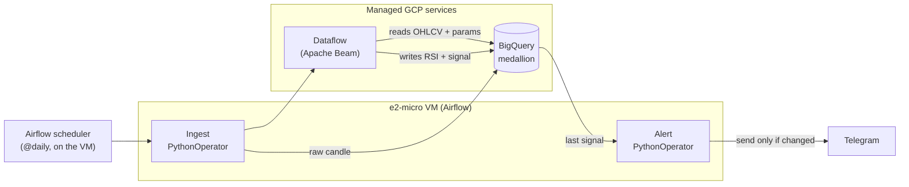

# Quantitative Trading-Signal Pipeline on GCP

A daily, fully reproducible data pipeline on Google Cloud for **quantitative trading
signals** — ingestion → storage → processing → orchestration → alerting, versioned,
containerized, and provisioned as code. It derives a **BUY / SELL / NEUTRAL** signal
and sends a **Telegram alert only when the signal changes**; on that same medallion
infrastructure the project will finally implement **Strategy 3**, its end goal: a
**multi-asset** (cross-asset TSMOM) trading system validated with ML (see
[End goal](#end-goal-a-multi-asset-ml-validated-strategy)).

> ⚠️ **Disclaimer — not financial advice.** The signal logic is a technical/educational
> example; the value is in the data engineering, not any expectation of returns.

---

## Table of contents

[Architecture](#architecture) · [Daily data flow](#daily-data-flow) ·
[Data model](#data-model-medallion) · [Repository layout](#repository-layout) ·
[Tech stack & design](#tech-stack--design-decisions) ·
[Setup & deployment](#setup--deployment) · [Testing & CI](#testing--ci) ·
[End goal](#end-goal-a-multi-asset-ml-validated-strategy) · [License](#license)

---

## Architecture

| Layer            | Tool                                 | Role in one line                                          |
|------------------|--------------------------------------|-----------------------------------------------------------|
| Repository       | GitHub                               | Code, IaC and CI/CD                                       |
| Orchestration    | Apache Airflow on an **e2-micro VM** | Schedules and triggers the daily DAG; runs the tasks      |
| Ingestion        | Python + CCXT / source APIs          | Downloads the daily BTC candle + macro/on-chain series    |
| Storage          | BigQuery (**medallion** model)       | `control`, `strategy`, `bronze`, `silver`, `gold`         |
| Processing       | Dataflow (Apache Beam)               | Conforms to silver, computes RSI, derives the signal      |
| Alerting         | Telegram Bot                         | Notifies only when the signal changes (DAG task)          |
| Infrastructure   | Terraform                            | Defines BigQuery + VM as code (IaC)                       |
| CI/CD            | GitHub Actions                       | ruff lint + pytest on every push                          |



Ingest and alert run as `PythonOperator`s on the VM; **Dataflow does not** — Airflow
only *launches* it, and the job runs on managed GCP workers.

---

## Daily data flow

1. **Scheduler** fires the `daily_btc_signal` DAG at **12:00 UTC** (`catchup=False`);
   the run processes `{{ ds }}` (yesterday's closed candle), with retries and a
   failure alert.
2. **Ingest — `PythonOperator` fan-out (one per series):** Binance BTC/USDT plus the
   macro / on-chain / attention series (MVRV, DXY, 10Y, 2Y, Fed funds, VIX, M2,
   supply, active addresses, tx count, Google Trends), each reusing its
   `orchestration/ingest/*` module; concurrency capped to fit the e2-micro's RAM.
3. **Conform — `stages/conform.py`:** consolidates daily candles from every bronze
   candle table into `ohlcv_validated` (`1d`) + the aggregated weekly candle (`1w`).
   *Rules:* multi-source ties go to the highest `priority`; weeks run **Monday→Sunday**
   (`WEEK(MONDAY)`), labelled by the opening Monday.
4. **RSI — `stages/rsi.py`:** Wilder RSI (recursive state) for `1d`/`1w`; full
   bootstrap first, incremental after. *Rule:* the first `rsi_period` bootstrap rows
   publish `rsi = NULL` (warm-up) and the signals stage skips them.
5. **Signal — `stages/signals.py`:** reads `strategy_rsi_daily_week`, walk-forwards
   the weekly RSI into a **per-week** trend state, combines it with the daily-RSI
   thresholds → BUY / SELL / NEUTRAL into `fact_signals`.
6. **Alert — `PythonOperator`:** sends the signal to Telegram **only if it changed**.
   *(Currently a stub that logs; Telegram client wired in T-10.)*

> Ingestion and Dataflow accept a date range (default = yesterday).
> `dataflow/cleanup.py` deletes silver/gold rows by symbol/temporality/dates/layer
> (emptying `rsi_features` forces a fresh RSI bootstrap).

---

## Data model (medallion)

A **medallion architecture** on BigQuery (project `trade-390514`, region
`us-central1`). The complete, authoritative DDL — every table, column, partition and
seed — lives in `sql/DDL.sql` (PK/FK constraints are `NOT ENFORCED`).

| Dataset                  | Layer    | Purpose                                                                 |
|--------------------------|----------|-------------------------------------------------------------------------|
| `prod_trade_control`     | Control  | Source registry and consolidation priority.                             |
| `prod_trade_strategy`    | Strategy | Strategy catalog + versioned params (`strategy_rsi_daily_week`, seed `14/40/70/30/70`). |
| `prod_trade_bronze`      | Bronze   | Raw landing — one table per source, as delivered.                       |
| `prod_trade_silver`      | Silver   | Conformed OHLCV (`ohlcv_validated`) + RSI features (`rsi_features`).     |
| `prod_trade_gold`        | Gold     | Signals fact (`fact_signals`) + training/monitoring views.              |

**Bronze.** Two **candle** tables feed `conform` (deduped by date, highest `priority`
wins): `binance_btcusd_daily_raw` (2017→, priority 3) and `bitstamp_btcusd_daily_raw`
(pre-Binance 2011→2017-08-16, priority 4). **Non-candle context series** (`priority
NULL`, never feed `conform`; own table; long daily series partition **monthly** for the
10000-partitions/table cap; each has a full-history `--backfill` + daily update and
**never fabricates a value** — gaps are alerted and skipped): **MVRV** (id 5), **DXY**
(6); from FRED — **M2** (ALFRED PIT vintages, 7), **10Y** (8), **Fed funds** (9), **2Y**
(10), **VIX** (11); from Coin Metrics — **supply** (12), **active addresses** (13), **tx
count** (14); **Google Trends** attention (weekly, 15 — bronze keeps the **raw**
per-window 0-100, the **stitched** series being the silver view
`vw_google_trends_btc_weekly`). For **Strategy 3**, eight ETFs
(SPY/EFA·IEF/TLT·GLD/DBC·UUP/FXY) land via **two sources competing by `priority`** —
Yahoo (16, primary) + stooq (17, fallback) — into `yahoo_etf_daily_raw` /
`stooq_etf_daily_raw` (keyed `(symbol, candle_date)`); BTC reuses spot. `coinapi_*` / `investing_*` DDL ready, ingestion pending.

**Silver.** `ohlcv_validated` = typed, de-duplicated OHLCV (`1d` + `1w`).
`rsi_features` = Wilder RSI with recursive state for `1d`/`1w` (idempotent incremental
updates, reusable across strategies).

**Gold.** `fact_signals` is the star-schema fact (one row per
`symbol/temporality/signal_start/strategy_id`). Two **training views** line up close +
RSI + MVRV + macro/on-chain features, all **point-in-time (as-of)** so there is no
look-ahead (M2 uses its ALFRED vintage; MVRV shifted +1 day): `vw_btc_training_daily`
(stationary features) and `vw_btc_training_weekly` (as-of Sunday); `vw_btc_monitor_daily`
exposes raw comparable levels for a Looker Studio QA dashboard.

---

## Repository layout

`orchestration/` runs *inside* Airflow on the VM; `dataflow/` ships to GCP. Ingestion
follows a `<source>_<symbol>_ingest.py` convention: each entry-point is thin (config
only) and shares family logic in a `*_common.py` module.

```
.
├── orchestration/                   # runs INSIDE Airflow on the VM
│   ├── docker-compose.yaml          # LocalExecutor + Postgres (no Celery)
│   ├── Dockerfile                   # Airflow 2.10.5 + ingest deps + isolated Beam venv
│   ├── scripts/provision_vm.sh      # gcloud bootstrap: e2-micro VM + swap + firewall
│   ├── dags/daily_btc_signal_dag.py # daily DAG: ingest → Dataflow → alert (12:00 UTC)
│   ├── pipeline_launch.py           # Airflow-free DAG helpers (testable in CI)
│   └── ingest/                      # CCXT / API → bronze (thin entry-points + *_common)
├── dataflow/                        # Beam pipeline (SHIPPED to GCP)
│   ├── pipeline.py · cleanup.py     # entry point + silver/gold cleanup
│   └── stages/                      # conform.py · rsi.py · signals.py
├── sql/DDL.sql                      # full medallion DDL + seeds
├── tests/                           # pytest unit suite + SQL contracts + opt-in integration
├── pyproject.toml · terraform_infra/ · .github/workflows/ci.yml
```

---

## Tech stack & design decisions

Right-sizing is part of the point — every tool choice is justified.

- **Single asset (BTC), daily batch** — the schema *scales* to more
  symbols/temporalities, but the running pipeline is deliberately scoped.
- **Airflow on an e2-micro VM, not Cloud Composer** (Composer runs 24/7,
  ~US$300–400/month even idle; the VM costs cents). Airflow is the **only trigger** —
  no Pub/Sub, no standalone ingestion service.
- **Dataflow despite tiny volume (kilobytes/day)** — the point is to demonstrate
  Apache Beam (~cents/month; only downside is worker start-up latency).
- **Terraform in scope (not optional):** infra (BigQuery + VM) as code = reproducible.
- **Idempotency everywhere.** Each stage truncates its staging table, Beam writes to
  staging, then a SQL `MERGE` upserts on the natural key; `rsi_features` keeps
  recursive state. Re-running never duplicates rows.
- **No secrets in the repo.** Telegram token / `chat_id` and GCP auth (the VM's
  attached service account via ADC — no key file) are never committed.

**IAM bootstrap (trade-off):** SA role bindings are created with `gcloud` during setup,
not Terraform yet (chicken-and-egg). Tracked debt: migrate to `google_project_iam_member`
(additive) so Google-managed bindings aren't wiped.

---

## Setup & deployment

> Project: `trade-390514` · Region: `us-central1` ·
> SA: `trade-pipeline@trade-390514.iam.gserviceaccount.com`

1. **GCP project & APIs.** Enable BigQuery, Dataflow, Compute Engine, Cloud Storage,
   IAM and Cloud Resource Manager.
2. **Service account & IAM.** Create the SA and grant role bindings with `gcloud`
   (bootstrap — see the IAM trade-off).
3. **BigQuery schema.**
   `bq query --use_legacy_sql=false --project_id=trade-390514 < sql/DDL.sql`.
4. **Infrastructure (Terraform).** Provision the datasets + e2-micro VM from
   `terraform_infra/` (`terraform init && plan && apply`).
5. **Airflow on the VM.** `provision_vm.sh` creates the VM (ephemeral external IP +
   locked-down firewall, SSH via IAP — ~10× cheaper than Cloud NAT) and brings up
   Airflow (LocalExecutor + Postgres, ~1 GB RAM + 2 GB swap; Beam in an isolated
   venv). GCP auth uses the VM's **attached service account** (ADC, no key file); the
   only secrets are in `.env`. See `orchestration/README.md`; **T-14** codifies the VM
   in Terraform.
6. **Telegram bot.** Create the bot, store its token and `chat_id` as secrets.

---

## Testing & CI

- **pytest** in `tests/` covers the *pure* logic (no GCP): Wilder RSI, the strategy
  (trend walk-forward, signal, Monday weeks), bronze→silver normalisation, cleanup,
  ingestion parsers, and **SQL-template contracts** (`WEEK(MONDAY)`, weekly OHLC, MERGE
  keys). Beam/BigQuery I/O is `# pragma: no cover`. **Coverage gate ≥ 85 %**;
  idempotency is covered (incremental RSI must match a full bootstrap). Run:
  `ruff check dataflow orchestration tests && pytest`.
- **Integration tests** (`test_integration_bq.py`, marker `integration`, opt-in):
  read-only checks against live BigQuery + an opt-in e2e idempotency replay.
- **GitHub Actions** (`ci.yml`) runs ruff + pytest on every push and PR to `main`
  (Python 3.12); `integration` stays deselected, so no GCP creds are needed.

---

## End goal: a multi-asset ML-validated strategy

**Strategy 3** is the destination: a multi-asset (cross-asset TSMOM) trend-follower.
Two single-asset predecessors are dropped — only their *return* thesis, not the pipeline.

- **[S1 — RSI directional](ml_strategy_docs/strategy_1_analysis.md) (`id=1`, in production):** the live pipeline above, kept as
  the engineering backbone; not *alpha* (one-crypto TA rarely clears **t > 3**, HLZ 2016).
- **[S2 — BTC momentum + on-chain meta-label](ml_strategy_docs/strategy_2_analysis.md) (discarded):** single-instrument TSMOM
  shows little per-asset predictability (Huang et al. 2020, JFE); never built.
- **[S3 — cross-asset TSMOM](ml_strategy_docs/strategy_3_analysis.md) (`id=3`, in progress):** TS momentum over equities, bonds,
  FX, commodities + **crypto sleeve**, vol scaling, cross-class weighting; v1 ETFs.

The deliverable is the pipeline + validation methodology, not a guaranteed Sharpe; the
full analysis is [`strategy_3_analysis.md`](ml_strategy_docs/strategy_3_analysis.md), one section per plan ticket:

| Analysis section | Ticket | Status |
|---|---|---|
| [Research thesis](ml_strategy_docs/strategy_3_analysis.md#research-thesis) | arc | ✅ |
| [Data sources per class](ml_strategy_docs/strategy_3_analysis.md#data-sources-per-class) | T-18 | ✅ |
| [Instrument universe](ml_strategy_docs/strategy_3_analysis.md#instrument-universe) | T-19 | ✅ |
| [Validation methodology](ml_strategy_docs/strategy_3_analysis.md#validation-methodology) | Epic 8 | ✍️ |
| [Baselines](ml_strategy_docs/strategy_3_analysis.md#baselines) | T-26 | ⏳ |
| [Verdict](ml_strategy_docs/strategy_3_analysis.md#verdict) | T-27/28 | ⏳ |

**Pending / out of scope:** IAM → Terraform; CoinAPI / Investing.com ingestion; GA re-calibration (offline notebook); dashboards; intraday.

---

## License

Add your preferred license here (e.g. MIT).
