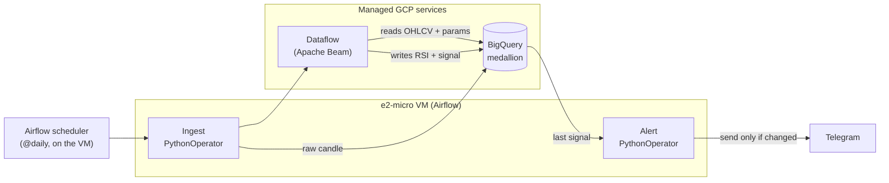

# BTC RSI Trading-Signal Pipeline on GCP

A daily, fully reproducible data pipeline that ingests BTC/USD candles, computes
the **RSI** indicator, derives a **BUY / SELL / NEUTRAL** signal, and sends a
**Telegram alert only when the signal changes**.

The project doubles as a **Data Engineer portfolio piece**: an end-to-end pipeline
on Google Cloud — ingestion → storage → processing → orchestration → alerting —
that is versioned, containerized, and provisioned as code.

> ⚠️ **Disclaimer — not financial advice.** The RSI signal logic is a technical /
> educational example, not an investment recommendation. The value of this project
> is in the data engineering, not in any expectation of returns.

---

## Table of contents

- [Architecture](#architecture)
- [Daily data flow](#daily-data-flow)
- [Date ranges & cleanup](#date-ranges--cleanup)
- [Data model (medallion)](#data-model-medallion)
- [Repository layout](#repository-layout)
- [Tech stack & design decisions](#tech-stack--design-decisions)
- [Setup & deployment](#setup--deployment)
- [Testing & CI](#testing--ci)
- [Roadmap](#roadmap)
- [Out of scope](#out-of-scope)
- [License](#license)

---

## Architecture

| Layer            | Tool                                 | Role in one line                                          |
|------------------|--------------------------------------|-----------------------------------------------------------|
| Repository       | GitHub                               | Code, IaC and CI/CD                                       |
| Orchestration    | Apache Airflow on an **e2-micro VM** | Schedules and triggers the daily DAG; runs the tasks      |
| Ingestion        | Python + CCXT (Binance)              | Downloads the daily BTC candle to **bronze** (DAG task)   |
| Storage          | BigQuery (**medallion** model)       | `control`, `strategy`, `bronze`, `silver`, `gold`         |
| Processing       | Dataflow (Apache Beam)               | Conforms to silver, computes RSI, derives the signal in gold |
| Alerting         | Telegram Bot                         | Notifies only when the signal changes (DAG task)          |
| Infrastructure   | Terraform                            | Defines BigQuery + VM as code (IaC)                       |
| CI/CD            | GitHub Actions                       | Lint + tests (pytest) on every push                       |



The ingestion and alert tasks run **inside Airflow** as `PythonOperator`s on the
same e2-micro VM. **Dataflow does not run on the VM**: Airflow only *launches* it,
and the job executes on managed GCP workers.

---

## Daily data flow

1. **Airflow scheduler** (on the VM) fires the DAG according to its daily cron.
2. **Ingest — `PythonOperator`:** runs `orchestration/ingest/binance_btc_ingest.py`,
   downloads the daily BTC/USDT candle from Binance via CCXT and writes it to
   `prod_trade_bronze.binance_btcusd_daily_raw` (idempotent MERGE on
   `symbol + candle_date`).
3. **Conform to silver — Dataflow (`stages/conform.py`):**
   - Reads the daily candles from **every bronze candle table** (Bitstamp for
     the pre-Binance history, Binance from 2017-08-17 onward) and consolidates
     them. **Business rule:** when more than one source covers the same date,
     the source with the **highest `priority`** in
     `prod_trade_control.source_priority` wins (today the sources are
     date-disjoint, so the tie-break is a safety net). Then normalizes fields
     and writes to `prod_trade_silver.ohlcv_validated` (`temporality='1d'`).
   - Aggregates the current week's daily candles into a weekly candle and MERGEs
     it into `ohlcv_validated` (`temporality='1w'`), keeping the weekly RSI fresh
     every day. **Business rule:** weeks run **Monday → Sunday** (BigQuery
     `WEEK(MONDAY)`); the weekly candle's `time_period_start` is the Monday that
     opens the week, and its `price_close` is the close of the week's last
     available day (Sunday once the week is complete).
4. **RSI to silver — Dataflow (`stages/rsi.py`):** computes RSI with **Wilder
   smoothing** (recursive state: `var_p_recursive`, `var_n_recursive`) for **two
   temporalities**: `1d` (daily) and `1w` (weekly). Writes to
   `prod_trade_silver.rsi_features`. Full bootstrap on the first run; incremental
   update on every subsequent run. **Business rule:** the first `rsi_period` rows
   of a bootstrap are **warm-up** — they store the recursive state but publish
   `rsi = NULL` (the zero-seeded averages haven't converged yet); the signals
   stage skips NULL-RSI rows.
5. **Signal to gold — Dataflow (`stages/signals.py`):** reads the active
   parameters from `prod_trade_strategy.strategy_rsi_daily_week`, runs a
   walk-forward over the weekly-RSI history to derive a **per-week** trend state,
   and for each daily candle in the range applies its week's state together with
   the daily-RSI thresholds to produce BUY / SELL / NEUTRAL. Writes to
   `prod_trade_gold.fact_signals` with a `trigger_params` JSON column.
6. **Alert — `PythonOperator`:** runs `orchestration/alerts/`, reads the latest signal
   from `fact_signals` and sends it to Telegram **only if it changed** versus the
   previous one.

> Steps 3–5 are Beam pipeline *stages* launched sequentially from
> `dataflow/pipeline.py`; steps 2 and 6 are `PythonOperator`s on the VM.

---

## Date ranges & cleanup

**Date range (batch / backfill).** Both ingestion and the Dataflow pipeline accept
a range:

- Ingestion: `ingest_daily_candles(start_date, end_date)` (`--start/--end` in the CLI).
- Dataflow: `--start_date/--end_date` (`end` optional; if omitted only `start` is
  processed; with neither, both default to yesterday — the daily job).

`conform` reads the range from bronze and recomputes every touched week; `rsi` stays
incremental over the recursive state (it processes any new candle, ideal for
contiguous forward ranges); `signals` emits one signal per day in the range using
the trend state of the corresponding week.

**Cleanup (reset / backward backfill).** `dataflow/cleanup.py` deletes rows from the
silver and gold tables (`ohlcv_validated`, `rsi_features`, `fact_signals`) with
optional, independent filters: `--symbol`, `--temporality`, `--start`, `--end` (no
filter = delete everything; `--dry-run` counts without deleting; `--layer` picks
silver/gold/both). Emptying `rsi_features` forces the RSI to redo its bootstrap —
useful when backfilling history older than the last recursive state.

---

## Data model (medallion)

Storage follows a **medallion architecture** on BigQuery (project `trade-390514`,
region `us-central1`). The complete, authoritative DDL lives in `sql/DDL.sql`
(PK/FK constraints are declared `NOT ENFORCED` — BigQuery uses them as
documentation and optimizer hints only).

| Dataset                  | Layer    | Purpose                                                                 |
|--------------------------|----------|-------------------------------------------------------------------------|
| `prod_trade_control`     | Control  | Operational metadata: source registry and consolidation priority.       |
| `prod_trade_strategy`    | Strategy | Strategy catalog and versioned parameters per strategy.                 |
| `prod_trade_bronze`      | Bronze   | Raw landing zone — one table per source, as delivered.                  |
| `prod_trade_silver`      | Silver   | Conformed, typed, de-duplicated OHLCV plus derived indicator features.  |
| `prod_trade_gold`        | Gold     | Business outcomes (trading signals) as a star-schema fact table.        |

**Control — `prod_trade_control`**
- `source_priority` — source registry with `source_id` (PK), `label`, `priority`,
  `is_active`, `url_source`, `name_source`, `datetime_update`. Binance is
  registered with `source_id=3`.

**Strategy — `prod_trade_strategy`**
- `strategy` — catalog: `strategy_id` (PK), `strategy_name`, `description`,
  `indicator_type`, `is_active`, `created_at`. Strategy `id=1`:
  `strategy_rsi_daily_week`.
- `strategy_rsi_daily_week` — versioned parameters for strategy 1:
  `param_version` (PK), `is_active`, `rsi_period`, `weekly_rsi_trend_start`,
  `weekly_rsi_trend_end`, `daily_rsi_oversold`, `daily_rsi_overbought`,
  `created_at`, `notes`. Version 1 seeded with `14 / 40 / 70 / 30 / 70`.

**Bronze — `prod_trade_bronze`**
- `binance_btcusd_daily_raw` — daily BTC/USDT candles from Binance via CCXT
  (since 2017-08-17, the pair's listing date). PK `(symbol, candle_date)`;
  partitioned by `candle_date`; idempotent MERGE. **(Implemented.)**
- `bitstamp_btcusd_daily_raw` — daily BTC/USD candles from Bitstamp via CCXT,
  the **pre-Binance history** (2011-08-18 → 2017-08-16; date cut-over, no
  overlap). Same schema and pattern as the Binance table; its entry-point
  `bitstamp_btc_ingest.py` shares the `ccxt_candle_common.py` logic. Source
  `priority 4` (> Binance) in `source_priority`. **(Implemented.)**
- `bitcoin_data_mvrv_zscore_daily_raw` — daily BTC MVRV Z-Score from
  bitcoin-data.com (BGeometrics). **Not a candle**: a daily metric (one value
  per date) that **does not feed `conform`'s OHLCV consolidation**. PK
  `mvrvz_date`; partitioned by `mvrvz_date`; idempotent MERGE. Full history
  (from 2009-01-03) loaded once from the **CSV export** (`/v1/mvrv-zscore/csv`)
  and refreshed daily from the **API** (`/v1/mvrv-zscore/last`). Source
  `priority NULL` (never competes in `conform`). The daily process **never
  fabricates a value**: a missing datum is **alerted and skipped**; the
  back-fill applies **one-off historical corrections**. **(Implemented.)**
- **Macro feature series (non-candle)** — four macroeconomic context series for
  model training. Like MVRV, they are **not candles and do not feed `conform`**:
  one value per date each, its own bronze table, partitioned by its date
  (**monthly** for the long series —DXY/10Y/Fed funds—: their daily history
  exceeds the 10000-partitions-per-table cap; M2 weekly and MVRV stay daily),
  idempotent MERGE, `priority NULL`. Full history loaded once (`--backfill`) and
  refreshed daily. The process **never fabricates a value**: if the source
  delivers a gap, it **alerts and skips**.
  - `yahoo_dxy_daily_raw` — **DXY** (ICE U.S. Dollar Index, 6-currency) from
    Yahoo Finance (`DX-Y.NYB`), daily OHLC since **1971**. PK/partition
    `dxy_date`. Stores only **closed** bars (drops the in-progress current-UTC
    day). Source `source_id=6`. **(Implemented.)**
  - `fred_wm2ns_weekly_raw` — **M2** (money stock, WM2NS, weekly NSA) from
    FRED/**ALFRED** with **point-in-time fidelity**: M2 is revised and published
    with a lag, so **every vintage** is stored. Natural key
    `(wm2ns_date, realtime_start)`; partitioned by `wm2ns_date`. To reconstruct
    what was known on day `X` without look-ahead, take the row with
    `realtime_start ≤ X ≤ realtime_end` (`realtime_end = 9999-12-31` while it is
    the latest revision). Source `source_id=7`. **(Implemented.)**
  - `fred_dgs10_daily_raw` — **10Y Treasury** (DGS10, daily yield, %) from FRED,
    since **1962**. Not revised: plain `(obs_date, obs_value)` series. Source
    `source_id=8`. **(Implemented.)**
  - `fred_dff_daily_raw` — **Fed funds** (DFF, daily effective rate, %) from
    FRED, since **1954**. Same plain shape as DGS10 (both share the
    `fred_common.py` logic via thin entry-points). Source `source_id=9`. **(Implemented.)**
  - `fred_dgs2_daily_raw` — **2Y Treasury** (DGS2, daily yield, %) from FRED,
    since **1976**. Same plain shape and shared logic as DGS10/DFF. Ingested raw
    so the training views can derive the **10Y-2Y term spread** and its momentum.
    Source `source_id=10`. **(Implemented.)**
  - `fred_vixcls_daily_raw` — **VIX** (VIXCLS, CBOE Volatility Index daily close)
    from FRED, since **1990**. Same plain shape/logic as DGS10/DFF (thin
    entry-point `fred_vix_ingest.py`). Macro risk-appetite feature. Source
    `source_id=11`. **(Implemented.)**
  - `coinmetrics_btc_supply_daily_raw` — **BTC circulating supply** (Coin Metrics
    `SplyCur`, daily) from the free community API (no key), since **2010**. Like
    MVRV it is its own bronze table (`supply_date` key, daily partition) and does
    not feed `conform`. It is the on-chain input the daily view turns into
    halving-cycle features. Source `source_id=12`. **(Implemented.)**
- `coinapi_btcusd_daily_raw`, `investing_btcusd_daily_raw` — DDL ready; ingestion
  pending.

**Silver — `prod_trade_silver`**
- `ohlcv_validated` — typed, de-duplicated OHLCV. One row per
  `(symbol, temporality, time_period_start)`. Holds both `temporality='1d'` (daily
  candle) and `temporality='1w'` (aggregated weekly candle, Monday → Sunday,
  labelled by its Monday). Partitioned by `DATE(time_period_start)`, clustered by
  `symbol, temporality`.
- `rsi_features` — RSI computed with **Wilder smoothing** and recursive state
  (`var_p_recursive`, `var_n_recursive`). One row per
  `(symbol, temporality, rsi_period, time_period_start)`. Covers `1d` and `1w`.
  Enables bootstrap + incremental, idempotent updates. Reusable across strategies.

**Gold — `prod_trade_gold`**
- `fact_signals` — one row per `(symbol, temporality, signal_start, strategy_id)`:
  `signal` (BUY/SELL/NEUTRAL), `trigger_params` (JSON with daily RSI, weekly RSI,
  thresholds and trend state), `signal_created_at`. Partitioned by
  `DATE(signal_start)`, clustered by `symbol, strategy_id`.
- **Training views** (read-only, line up close + RSI + MVRV + macro features for
  model training; close and RSI already co-live in `rsi_features`):
  - **MVRV 1-day lag:** the source publishes day `D-1`'s value under
    `mvrvz_date = D` (the 2026-06-10 row is really 2026-06-09), so the join
    shifts **+1 day** to recover the real date.
  - **Macro features aligned point-in-time (as-of):** DXY, 10Y, Fed funds and M2
    join the **latest value known on/before** the day (forward-filling
    weekend/holiday gaps), never a future value. In SQL it is one CTE per series
    with a range-join + `QUALIFY ROW_NUMBER()` (BigQuery can't de-correlate an
    `ORDER BY/LIMIT` subquery). **M2** picks its **vintage current** that day
    (`realtime_start ≤ D ≤ realtime_end`, latest observation) — that is what the
    stored ALFRED vintages are for, so there is no look-ahead.
  - **10Y-2Y term spread + momentum:** `spread_10y_2y = treasury_10y -
    treasury_2y` (curve **level**; negative = inverted), its change vs ~1 month
    ago (`spread_10y_2y_chg_1m`, via `LAG` 30 daily rows / 4 weekly rows) and a
    boolean `dis_inverting_from_neg` — TRUE when the spread was **inverted** a
    month ago and has **risen** since (steepening out of inversion). The level
    flags inversion; the change/flag capture the **regime-transition** moment the
    level alone cannot distinguish.
  - **Daily view = stationary model features only.** `vw_btc_training_daily`
    exposes only model-ready (stationary) features; the **raw levels**
    (`price_close, dxy, m2, treasury_10y/2y, fed_funds, circ_supply`) are used
    internally to derive them but are **not exposed** (levels are non-stationary;
    price/labels still live in `silver.rsi_features`). Daily-only derived features:
    - `vix` — VIX as-of the day (point-in-time, same as the other macro series).
    - `rsi_weekly` — the **previous week's** weekly RSI(14): the most recent week
      ending **strictly before** the week containing the day (its Monday < D's
      Monday). Excludes the still-forming current week and the week closing on D
      itself, so the value is stable across the whole week with no look-ahead.
    - `price_vs_ema365` — price deviation from its 365-day EMA (`price/EMA − 1`,
      a stationary trend/regime feature). The EMA is computed as an **exact
      closed-form** of the recursive EMA in a single window pass (α = 2/366), so
      the view stays always-fresh without a recursive CTE. **Warm-up: NULL for the
      first 365 rows** (an EMA365 is not an annual trend yet), like the RSI.
    - `dxy_vs_ema365` — DXY deviation from its own 365-day EMA (same form and
      warm-up; moot in practice as DXY history starts 1971).
    - `realized_vol_30d` — realised volatility: stddev of the last **30 daily
      log-returns** (`r_t = ln(P_t / P_{t-1})`) annualised `× √365`. **Warm-up:
      NULL until the full 30-return window** exists (a stddev of 2–3 returns is
      noise).
    - `m2_yoy_log` — M2 log year-over-year growth: `ln(M2_t / M2_{t-52w})`;
      `m2_roc_13w_ann` — M2 13-week rate of change annualised:
      `(M2_t / M2_{t-13w})^(52/13) − 1`. Both point-in-time vintage at every end.
    - `teny_chg_30d` — 10Y yield 30-day **change** (`DGS10 − DGS10_{−30d}`, more
      stationary than the level).
    - **Halving-cycle features** — `cycle_phase` is the block-count fraction
      through the current halving epoch (epoch fixed by the known halving dates;
      `(supply − supply_at_halving) / epoch_issuance` recovers the block fraction
      from circulating supply), with its cyclic encoding `cycle_phase_sin` /
      `cycle_phase_cos`, and `issuance_rate_ann`
      (`52560 × block_subsidy / circulating_supply`, the annualised issuance rate
      that halves at each halving).
  - `vw_btc_training_daily` — columns `date, rsi, rsi_weekly, mvrv_zscore, vix,
    price_vs_ema365, dxy_vs_ema365, realized_vol_30d, m2_yoy_log, m2_roc_13w_ann,
    teny_chg_30d, spread_10y_2y, spread_10y_2y_chg_1m, dis_inverting_from_neg,
    cycle_phase, cycle_phase_sin, cycle_phase_cos, issuance_rate_ann`
    (macro/weekly-RSI as-of the trading day).
  - `vw_btc_training_weekly` — columns `week_start_monday, week_end_sunday,
    price_close, rsi, mvrv_zscore, dxy, treasury_10y, treasury_2y, fed_funds, m2,
    spread_10y_2y, spread_10y_2y_chg_1m, dis_inverting_from_neg` (macro as-of the
    week's **Sunday**; MVRV of the Sunday under `mvrvz_date = Monday + 7`).
  - Both filter `rsi_period = 14` and drop the warm-up (`rsi IS NOT NULL`). They
    are views on purpose (tiny dataset, always fresh); freeze an experiment with
    `CREATE TABLE <snapshot> AS SELECT * FROM <view>`.

---

## Repository layout

`dags/`, `ingest/` and `alerts/` live under `orchestration/` because they run *inside*
Airflow on the VM. `dataflow/` is kept separate because it is shipped to GCP.

Legend: ✅ implemented · ⏳ pending · 📁 empty folder with `.gitkeep`.

```
.
├── .gitignore                       # ✅ ignores venv, __pycache__, secrets, etc.
├── README.md                        # ✅ this file
├── orchestration/                         # runs INSIDE Airflow on the VM
│   ├── docker-compose.yaml          # ✅ Airflow stack: LocalExecutor + Postgres (no Celery)
│   ├── Dockerfile                   # ✅ Airflow 2.10.5 image + ingest deps + isolated Beam venv
│   ├── requirements.txt             # ✅ extra deps baked into the Airflow env (+ Google provider)
│   ├── .env.example                 # ✅ secrets/config template (real .env is git-ignored)
│   ├── README.md                    # ✅ deployment guide (provision + bring up Airflow)
│   ├── scripts/
│   │   └── provision_vm.sh          # ✅ gcloud bootstrap: e2-micro VM + 2 GB swap + Docker
│   ├── plugins/                     # 📁 Airflow plugins (empty)
│   ├── dags/                        # 📁 daily DAG (pending)
│   ├── ingest/
│   │   ├── __init__.py              # ✅ re-exports ingest_daily_candles, fetch_daily_candles_range
│   │   ├── ccxt_candle_common.py    # ✅ Shared CCXT→bronze logic (NOT an entry-point)
│   │   ├── binance_btc_ingest.py    # ✅ Thin Binance BTC entry-point (single day or range/backfill)
│   │   ├── bitstamp_btc_ingest.py   # ✅ Thin Bitstamp BTC entry-point (pre-Binance history)
│   │   ├── bitcoin_data_mvrv_ingest.py # ✅ MVRV Z-Score ingestion (bitcoin-data.com) → bronze (CSV backfill + daily API update)
│   │   ├── yahoo_dxy_ingest.py      # ✅ DXY ingestion (Yahoo DX-Y.NYB) → bronze (backfill + daily update, closed bars only)
│   │   ├── fred_common.py           # ✅ Shared FRED logic + primitives (NOT an entry-point)
│   │   ├── fred_10y_ingest.py       # ✅ Thin 10Y Treasury (DGS10) entry-point → bronze
│   │   ├── fred_2y_ingest.py        # ✅ Thin 2Y Treasury (DGS2) entry-point → bronze (10Y-2Y spread feature)
│   │   ├── fred_fedfunds_ingest.py  # ✅ Thin Fed funds (DFF) entry-point → bronze
│   │   ├── fred_vix_ingest.py       # ✅ Thin VIX (VIXCLS) entry-point → bronze
│   │   ├── fred_m2_ingest.py        # ✅ M2 ingestion (FRED/ALFRED WM2NS) → bronze with point-in-time vintages
│   │   ├── coinmetrics_btc_supply_ingest.py # ✅ BTC circulating supply (Coin Metrics SplyCur) → bronze (halving-cycle feature)
│   │   └── requirements.txt         # ✅ ingestion deps (ccxt, google-cloud-bigquery, tenacity)
│   └── alerts/                      # 📁 Telegram client (pending)
├── dataflow/                        # Beam pipeline (SHIPPED to GCP)
│   ├── __init__.py                  # ✅
│   ├── pipeline.py                  # ✅ entry point; orchestrates the 3 stages (--start_date/--end_date)
│   ├── cleanup.py                   # ✅ deletes silver/gold by symbol/temporality/dates
│   ├── stages/
│   │   ├── conform.py               # ✅ Stage 1: bronze → ohlcv_validated (1d + 1w)
│   │   ├── rsi.py                   # ✅ Stage 2: ohlcv_validated → rsi_features (recursive Wilder)
│   │   └── signals.py               # ✅ Stage 3: rsi_features → fact_signals (per-week trend)
│   └── requirements.txt             # ✅ Beam/Dataflow deps
├── sql/
│   └── DDL.sql                      # ✅ full medallion DDL + seeds
├── tests/                           # ✅ pytest unit tests for the pure logic
│   ├── conftest.py                  # ✅ shared fixtures (OHLCV / weekly-RSI builders, strategy params)
│   ├── test_rsi.py                  # ✅ Wilder RSI + bootstrap/incremental continuity
│   ├── test_signals.py              # ✅ trend walk-forward + BUY/SELL/NEUTRAL + DoFn
│   ├── test_conform.py              # ✅ bronze→silver row normalisation
│   ├── test_cleanup.py              # ✅ filter/clause/target helpers + clean_tables
│   ├── test_ccxt_candle_common.py   # ✅ shared CCXT ingest: mapping, closed-bar/sort, MERGE (symbol,candle_date), entry-point config
│   ├── test_bitcoin_data_mvrv_ingest.py # ✅ MVRV ingest: CSV parser, historical correction + missing-value alert, MERGE chunking, DDL contract
│   ├── test_yahoo_dxy_ingest.py     # ✅ DXY ingest: chart parser, null/in-progress-bar skip, MERGE chunking, DDL contract
│   ├── test_fred_common.py          # ✅ Plain FRED ingest: observations parser, `.`→NULL, chunking, 10Y/2Y/Fed funds/VIX entry-point config, DDL contract
│   ├── test_coinmetrics_btc_supply_ingest.py # ✅ BTC supply ingest: metrics parser, NaN→NULL, query URL, MERGE chunking, DDL contract
│   ├── test_fred_m2_ingest.py       # ✅ M2 ingest: ALFRED vintage parser, point-in-time composite key, MERGE chunking, DDL contract
│   ├── test_sql_contracts.py        # ✅ SQL-template guards (WEEK(MONDAY), OHLC rules, MERGE keys)
│   └── test_integration_bq.py       # ✅ live-BQ validations + opt-in pipeline replay (-m integration)
├── pyproject.toml                   # ✅ pytest + coverage + ruff config
├── requirements-dev.txt             # ✅ test/CI deps (pytest, pytest-cov, pytest-mock, ruff)
├── terraform_infra/                 # 📁 Terraform IaC (BigQuery + VM, pending)
└── .github/
    └── workflows/
        └── ci.yml                   # ✅ GitHub Actions: ruff lint + pytest on every push
```

---

## Tech stack & design decisions

Right-sizing is part of the point — every tool choice is justified below.

- **Single asset (BTC), daily batch.** No intraday, no multi-asset. The schema is
  designed to *scale* to more symbols/temporalities (via the `symbol` and
  `temporality` columns), but the running pipeline is deliberately scoped.
- **Airflow on an e2-micro VM, not Cloud Composer.** Composer keeps the environment
  running 24/7 (~US$300–400/month even idle), disproportionate for a once-a-day
  task. The e2-micro VM costs cents per month.
- **Dataflow is kept despite tiny volume (kilobytes/day).** The goal is to
  demonstrate Apache Beam. Cost is ~cents/month; the only real downside is worker
  start-up latency (a few minutes).
- **Airflow is the only trigger — no Pub/Sub, no standalone ingestion service.**
  Ingestion lives in the repo and runs as a DAG task.
- **Terraform is in scope (not optional).** Infra (BigQuery + VM) is defined as
  code so the project is reproducible — a strong Data Engineer signal.
- **Training is separated from inference.** The genetic algorithm that optimizes
  the 4 RSI strategy parameters lives in the
  `ag-determina-parametros-de-estrategia-rsi.ipynb` notebook (*offline training*),
  **not** part of the daily pipeline. The daily job only applies already-fixed
  parameters read from the strategy layer.
- **Idempotency everywhere.** Re-running any task must not duplicate candles or
  signals: each stage explicitly truncates its staging table (`TRUNCATE TABLE`
  before the Beam pipeline — with `FILE_LOADS`, Beam's `WRITE_TRUNCATE` only
  applies when ≥1 row is written), Beam writes to staging, then a SQL `MERGE`
  upserts into the target on the natural key; `rsi_features` keeps recursive
  state for incremental updates.
- **No secrets in the repo.** Telegram token / `chat_id` and the service account
  are passed as secrets / environment variables, never committed.

### IAM bootstrap (current trade-off)

The service-account **role bindings are created with `gcloud` during the initial
setup**, *not* in Terraform yet — a chicken-and-egg problem (Terraform needs the
project, APIs and identity to exist before it can manage IAM). Migrating them to
Terraform is **tracked technical debt**: use `google_project_iam_member` (additive,
not authoritative) so Google-managed bindings are not wiped. Until then, IAM has two
sources of truth — assumed and documented, not an oversight.

---

## Setup & deployment

> Project: `trade-390514` · Region: `us-central1` ·
> Service account: `trade-pipeline@trade-390514.iam.gserviceaccount.com`

1. **GCP project & APIs.** Enable BigQuery, Dataflow, Compute Engine, Cloud Storage
   (Dataflow staging/temp bucket), IAM and Cloud Resource Manager (the last two are
   needed so Terraform can manage IAM and project-level resources).
2. **Service account & IAM.** Create the service account and grant its role bindings
   with `gcloud` (bootstrap step — see the IAM trade-off above).
3. **BigQuery schema.** Run the idempotent DDL:
   ```bash
   bq query --use_legacy_sql=false --project_id=trade-390514 < sql/DDL.sql
   ```
4. **Infrastructure (Terraform).** Provision the BigQuery datasets and the e2-micro
   VM from `terraform_infra/`:
   ```bash
   cd terraform_infra
   terraform init && terraform plan && terraform apply
   ```
5. **Airflow on the VM.** Provision the e2-micro VM and bring up Airflow with
   Docker Compose (`orchestration/`). The stack is trimmed to **LocalExecutor +
   Postgres** (no Celery/Redis) to fit ~1 GB of RAM, with **2 GB of swap** added
   by the bootstrap; Beam runs in an isolated venv so it does not clash with
   Airflow's deps. Place the secrets (service-account key, Telegram token /
   `chat_id`) on the VM via `.env` + a mounted `keys/sa.json` — never committed.
   ```bash
   cd orchestration
   ./scripts/provision_vm.sh                  # create the VM (gcloud bootstrap)
   # then, on the VM:
   cp .env.example .env                        # fill in real secrets
   docker compose build
   docker compose up airflow-init && docker compose up -d
   ```
   The VM is created with `gcloud` as a bootstrap step; **T-14** codifies the same
   VM in Terraform. See `orchestration/README.md` for the full guide.
6. **Telegram bot.** Create the bot, obtain its token and `chat_id`, and store them
   as secrets — never in the repo.

---

## Testing & CI

- **pytest** in `tests/` covers the *pure* pipeline logic — no GCP needed: the
  Wilder RSI (`compute_rsi_rows`, `_rsi_value`), the strategy (`_compute_trend_states`,
  `_apply_signal`, `_week_start`, `_ComputeSignalFn`), the bronze→silver
  normalisation (`_NormaliseBinanceRow`), the cleanup helpers, and **SQL-template
  contracts** (`test_sql_contracts.py`): Monday-based weeks (`WEEK(MONDAY)`,
  never a bare `WEEK`), weekly OHLC rules (open = first day, close = last day),
  and the natural key of every MERGE. Beam/BigQuery I/O
  functions are marked `# pragma: no cover` (they require live GCP) so coverage
  reflects the testable logic. Coverage gate: **≥ 85 %** (configured in
  `pyproject.toml`).
- **Idempotency is covered at the logic level:** a continuity test asserts that the
  incremental RSI update reproduces exactly what a full bootstrap would
  (`test_incremental_matches_full_bootstrap`), guarding the no-duplicate-history
  guarantee that the BigQuery `MERGE` relies on.
- **Lint (ruff):** static analysis runs alongside the tests. A focused, high-signal
  ruleset (Pyflakes `F`, pycodestyle `E`/`W`, isort `I`) is configured in
  `pyproject.toml`; run it with `ruff check dataflow orchestration tests`.
- **Run locally:**
  ```bash
  pip install -r dataflow/requirements.txt \
              -r orchestration/ingest/requirements.txt \
              -r requirements-dev.txt
  ruff check dataflow orchestration tests
  pytest
  ```
- **Integration tests** (`test_integration_bq.py`, marker `integration`): read-only
  validations against the live BigQuery tables — Monday-labelled weeks, weekly OHLC
  = aggregation of its dailies, Wilder warm-up NULLs in the exact first `rsi_period`
  rows, natural-key uniqueness in all four tables, canonical signal values and
  queryable `trigger_params` JSON. The RSI ∈ [0, 100] bound is checked over the
  real Binance-ingested history (the agreed substitute for Hypothesis
  property-based testing). Deselected by default and skipped without GCP
  credentials; run them with:
  ```bash
  pytest -m integration --no-cov
  ```
  An opt-in end-to-end replay (`test_pipeline_replay_is_idempotent`) re-runs the
  full pipeline twice over the latest bronze day and asserts stable counts — the
  manual T-08 check. It requires `TRADE_GCP_TEMP_LOCATION=gs://...` (slow, incurs
  GCP cost).
- **GitHub Actions** (`.github/workflows/ci.yml`) runs **ruff lint + pytest** on
  every push and on PRs to `main`, on Python 3.12 (matching the pinned runtime).
  CI runs the unit suite only — the `integration` marker stays deselected, so no
  GCP credentials are needed. The coverage gate (≥ 85 %) is enforced by the same
  `pytest` run.

---

## Roadmap

- **Automatic re-calibration** with the genetic algorithm: a separate DAG that
  updates the strategy parameters. Requires **walk-forward validation** to avoid
  overfitting and look-ahead bias.
- **Migrate the IAM role bindings** from `gcloud` to Terraform
  (`google_project_iam_member`), leaving a single source of truth for IAM.
- **CoinAPI and Investing.com ingestion** (bronze tables already defined in the DDL).

---

## Out of scope (for now)

- The genetic-algorithm re-calibration (currently an offline notebook).
- Dashboards / visualization.
- Multiple assets or intraday frequencies (the silver/gold model already supports
  `symbol` and `temporality` to grow in the future).

---

## License

Add your preferred license here (e.g. MIT).
