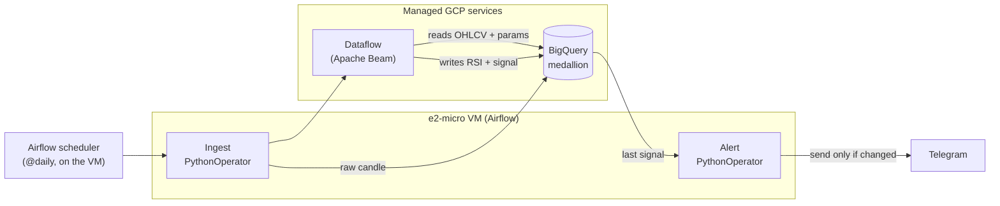

# BTC RSI Trading-Signal Pipeline on GCP

A daily, fully reproducible data pipeline that ingests BTC/USD candles, computes
the **RSI** indicator, derives a **BUY / SELL / NEUTRAL** signal, and sends a
**Telegram alert only when the signal changes**.

The project doubles as a **Data Engineer portfolio piece**: an end-to-end pipeline
on Google Cloud — ingestion → storage → processing → orchestration → alerting —
that is versioned, containerized, and provisioned as code.

> ⚠️ **Disclaimer — not financial advice.** The RSI signal logic is a technical /
> educational example, not an investment recommendation. The value of this project
> is in the data engineering, not in any expectation of returns.

---

## Table of contents

- [Architecture](#architecture)
- [Daily data flow](#daily-data-flow)
- [Date ranges & cleanup](#date-ranges--cleanup)
- [Data model (medallion)](#data-model-medallion)
- [Repository layout](#repository-layout)
- [Tech stack & design decisions](#tech-stack--design-decisions)
- [Setup & deployment](#setup--deployment)
- [Testing & CI](#testing--ci)
- [Roadmap](#roadmap)
- [Out of scope](#out-of-scope)
- [License](#license)

---

## Architecture

| Layer            | Tool                                 | Role in one line                                          |
|------------------|--------------------------------------|-----------------------------------------------------------|
| Repository       | GitHub                               | Code, IaC and CI/CD                                       |
| Orchestration    | Apache Airflow on an **e2-micro VM** | Schedules and triggers the daily DAG; runs the tasks      |
| Ingestion        | Python + CCXT / source APIs          | Downloads the daily BTC candle + macro/on-chain series    |
| Storage          | BigQuery (**medallion** model)       | `control`, `strategy`, `bronze`, `silver`, `gold`         |
| Processing       | Dataflow (Apache Beam)               | Conforms to silver, computes RSI, derives the signal in gold |
| Alerting         | Telegram Bot                         | Notifies only when the signal changes (DAG task)          |
| Infrastructure   | Terraform                            | Defines BigQuery + VM as code (IaC)                       |
| CI/CD            | GitHub Actions                       | ruff lint + pytest on every push                          |



The ingestion and alert tasks run **inside Airflow** as `PythonOperator`s on the
same e2-micro VM. **Dataflow does not run on the VM**: Airflow only *launches* it,
and the job executes on managed GCP workers.

---

## Daily data flow

1. **Airflow scheduler** (on the VM) fires the `daily_btc_signal` DAG at **12:00
   UTC** (`catchup=False`); the run processes `{{ ds }}` — yesterday's fully closed
   candle. Tasks carry retries with exponential backoff and a failure alert.
2. **Ingest — `PythonOperator` fan-out (one per series):** Binance BTC/USDT plus
   the macro / on-chain / attention series (MVRV, DXY, 10Y, 2Y, Fed funds, VIX, M2,
   supply, active addresses, tx count, Google Trends investor attention), each
   reusing its `orchestration/ingest/*` module. Concurrency is capped to two tasks
   to fit the e2-micro's RAM. Google Trends is weekly — its step refreshes the
   latest window in place (idempotent). Bitstamp is excluded — pre-2017 history, not
   a daily source.
3. **Conform to silver — Dataflow (`stages/conform.py`):** reads the daily candles
   from every bronze candle table and consolidates them, then writes
   `prod_trade_silver.ohlcv_validated` (`temporality='1d'`) and the aggregated
   weekly candle (`temporality='1w'`).
   - *Business rule — multi-source priority:* when more than one source covers a
     date, the highest `priority` in `source_priority` wins (today sources are
     date-disjoint, so the tie-break is a safety net).
   - *Business rule — Monday→Sunday weeks:* the weekly candle aggregates Monday→
     Sunday (`WEEK(MONDAY)`); `time_period_start` is the opening Monday and
     `price_close` is the last available day's close.
4. **RSI to silver — Dataflow (`stages/rsi.py`):** RSI with **Wilder smoothing**
   (recursive state) for `1d` and `1w`. Full bootstrap on the first run,
   incremental after.
   - *Business rule — warm-up:* the first `rsi_period` rows of a bootstrap store
     the recursive state but publish `rsi = NULL`; the signals stage skips them.
5. **Signal to gold — Dataflow (`stages/signals.py`):** reads the active parameters
   from `strategy_rsi_daily_week`, runs a walk-forward over the weekly RSI to derive
   a **per-week** trend state, and combines it with the daily-RSI thresholds to
   produce BUY / SELL / NEUTRAL into `fact_signals` (with a `trigger_params` JSON
   column).
6. **Alert — `PythonOperator`:** reads the latest signal and sends it to Telegram
   **only if it changed**. *(Currently a stub that logs; the Telegram client is
   wired in T-10.)*

> Steps 3–5 are Beam *stages* launched sequentially from `dataflow/pipeline.py`;
> steps 2 and 6 are `PythonOperator`s on the VM.

---

## Date ranges & cleanup

Both ingestion and the Dataflow pipeline accept a date range (`--start/--end`,
`--start_date/--end_date`); with no range, both default to yesterday — the daily
job. `conform` recomputes every touched week, `rsi` stays incremental over the
recursive state, and `signals` emits one signal per day.

`dataflow/cleanup.py` deletes rows from the silver/gold tables with optional
filters (`--symbol`, `--temporality`, `--start`, `--end`, `--layer`; `--dry-run`
counts only). Emptying `rsi_features` forces the RSI to redo its bootstrap —
useful when backfilling history older than the last recursive state.

---

## Data model (medallion)

Storage follows a **medallion architecture** on BigQuery (project `trade-390514`,
region `us-central1`). The complete, authoritative DDL — every table, column,
partition and seed — lives in `sql/DDL.sql` (PK/FK constraints are `NOT ENFORCED`,
documentation/optimizer hints only).

| Dataset                  | Layer    | Purpose                                                                 |
|--------------------------|----------|-------------------------------------------------------------------------|
| `prod_trade_control`     | Control  | Source registry and consolidation priority.                             |
| `prod_trade_strategy`    | Strategy | Strategy catalog and versioned parameters (`strategy_rsi_daily_week`, seed `14/40/70/30/70`). |
| `prod_trade_bronze`      | Bronze   | Raw landing — one table per source, as delivered.                       |
| `prod_trade_silver`      | Silver   | Conformed, de-duplicated OHLCV (`ohlcv_validated`) + RSI features (`rsi_features`). |
| `prod_trade_gold`        | Gold     | Signals fact table (`fact_signals`) + training views.                   |

**Bronze sources.** Two **candle** tables feed `conform` (deduped by date, highest
`priority` wins): `binance_btcusd_daily_raw` (Binance BTC/USDT, 2017-08-17→,
priority 3) and `bitstamp_btcusd_daily_raw` (Bitstamp pre-Binance history
2011→2017-08-16, priority 4).

Plus **non-candle context series** (one value per date — per week for Google
Trends; own table, `priority NULL`, never feed `conform`; long daily series
partition **monthly** to stay under the 10000-partitions-per-table cap). Each has a
full-history `--backfill` + daily update and **never fabricates a value** (a gap is
alerted and skipped):

| Table                                       | Series                       | Source            | id |
|---------------------------------------------|------------------------------|-------------------|----|
| `bitcoin_data_mvrv_zscore_daily_raw`        | MVRV Z-Score                 | bitcoin-data.com  | 5  |
| `yahoo_dxy_daily_raw`                        | DXY (ICE dollar index)       | Yahoo Finance     | 6  |
| `fred_wm2ns_weekly_raw`                      | M2 (PIT vintages)            | FRED / ALFRED     | 7  |
| `fred_dgs10_daily_raw`                       | 10Y Treasury yield           | FRED              | 8  |
| `fred_dff_daily_raw`                         | Fed funds rate               | FRED              | 9  |
| `fred_dgs2_daily_raw`                        | 2Y Treasury yield            | FRED              | 10 |
| `fred_vixcls_daily_raw`                      | VIX                          | FRED              | 11 |
| `coinmetrics_btc_supply_daily_raw`           | BTC circulating supply       | Coin Metrics      | 12 |
| `coinmetrics_btc_active_addresses_daily_raw` | Active addresses (on-chain)  | Coin Metrics      | 13 |
| `coinmetrics_btc_tx_count_daily_raw`         | Tx count (on-chain)          | Coin Metrics      | 14 |
| `google_trends_btc_weekly_raw`               | Investor attention (weekly)  | Google Trends     | 15 |

The three Coin Metrics series (supply, active addresses, tx count) share one
`coinmetrics_common` family module. Google Trends only returns a weekly series for
request windows under ~5 years, so bronze stores the **raw** 0-100 **per request
window** (overlapping windows, `window_start` in the key) and the continuous
**stitched** series is the silver view `vw_google_trends_btc_weekly` (each window
re-scaled on its overlap, then re-normalised 0-100). Bronze stays raw — the
transform lives downstream, the medallion rule for every source.

`coinapi_btcusd_daily_raw` and `investing_btcusd_daily_raw` have DDL ready;
ingestion is pending.

**Silver.** `ohlcv_validated` holds typed, de-duplicated OHLCV (`1d` daily + `1w`
Monday→Sunday weekly). `rsi_features` holds Wilder RSI with recursive state for
`1d`/`1w`, enabling idempotent incremental updates — reusable across strategies.

**Gold.** `fact_signals` is the star-schema fact (one row per
`symbol/temporality/signal_start/strategy_id`, with `signal` and `trigger_params`
JSON). Two **training views** line up close + RSI + MVRV + macro features for
modelling, all aligned **point-in-time (as-of)** so there is no look-ahead — each
macro series takes the latest value known on/before the day, **M2** uses its
**ALFRED vintage current that day**, and MVRV is shifted +1 day (the source
publishes `D-1` under date `D`):

- `vw_btc_training_daily` — **stationary** model features only (raw levels stay
  internal): `rsi`, `rsi_weekly` (previous closed week), `mvrv_zscore`, `vix`,
  `price_vs_ema365` / `dxy_vs_ema365` (deviation from a closed-form 365-day EMA),
  `realized_vol_30d`, `m2_yoy_log` / `m2_roc_13w_ann`, `teny_chg_30d`,
  `spread_10y_2y` (+ its 1-month change and a `dis_inverting_from_neg` regime
  flag), halving-cycle features (`cycle_phase` + sin/cos, `issuance_rate_ann`),
  on-chain `active_addresses_yoy_log` / `tx_count_yoy_log` (year-over-year log
  growth of the raw counts) and `investor_attention` (weekly Google Trends, as-of
  the prior closed week). Warm-up NULLs mirror the RSI (EMA365 needs 365 rows, vol
  needs 30 returns).
- `vw_btc_training_weekly` — weekly close + RSI + MVRV + macro levels + the 10Y-2Y
  spread, as-of the week's **Sunday**.
- `vw_btc_monitor_daily` — dashboard / QA view (the Looker Studio report source):
  the raw, comparable **levels** of the ingested series side by side (price, daily &
  weekly RSI, MVRV, VIX, attention, Coin Metrics on-chain counts) — for eyeballing
  what was ingested, **not** model features.

Both filter `rsi_period=14` and drop the warm-up. They are views on purpose (tiny
dataset, always fresh); freeze an experiment with `CREATE TABLE … AS SELECT`. Full
column definitions are in `sql/DDL.sql`.

---

## Repository layout

`dags/`, `ingest/` and `alerts/` live under `orchestration/` (they run *inside*
Airflow on the VM); `dataflow/` is separate because it ships to GCP. Ingestion
follows a `<source>_<symbol>_ingest.py` convention: each entry-point is thin
(config only) and shares its family logic in a `*_common.py` module.

```
.
├── orchestration/                     # runs INSIDE Airflow on the VM
│   ├── docker-compose.yaml            # LocalExecutor + Postgres (no Celery)
│   ├── Dockerfile                     # Airflow 2.10.5 + ingest deps + isolated Beam venv
│   ├── scripts/provision_vm.sh        # gcloud bootstrap: e2-micro VM + swap + Docker
│   ├── dags/daily_btc_signal_dag.py   # daily DAG: ingest → Dataflow → alert (12:00 UTC)
│   ├── pipeline_launch.py             # Airflow-free DAG helpers (testable in CI)
│   └── ingest/                        # CCXT / API → bronze (thin entry-points + *_common logic)
├── dataflow/                          # Beam pipeline (SHIPPED to GCP)
│   ├── pipeline.py                    # entry point; orchestrates the 3 stages
│   ├── cleanup.py                     # deletes silver/gold by symbol/temporality/dates
│   └── stages/                        # conform.py · rsi.py · signals.py
├── sql/DDL.sql                        # full medallion DDL + seeds
├── tests/                             # pytest unit suite + SQL contracts + opt-in integration
├── pyproject.toml                     # pytest + coverage + ruff config
├── terraform_infra/                   # 📁 Terraform IaC (BigQuery + VM, pending)
└── .github/workflows/ci.yml           # GitHub Actions: ruff + pytest on every push
```

---

## Tech stack & design decisions

Right-sizing is part of the point — every tool choice is justified below.

- **Single asset (BTC), daily batch.** No intraday, no multi-asset. The schema
  *scales* to more symbols/temporalities (via `symbol`/`temporality`), but the
  running pipeline is deliberately scoped.
- **Airflow on an e2-micro VM, not Cloud Composer.** Composer runs 24/7
  (~US$300–400/month even idle), disproportionate for a once-a-day task. The
  e2-micro VM costs cents per month.
- **Dataflow is kept despite tiny volume (kilobytes/day).** The goal is to
  demonstrate Apache Beam; cost is ~cents/month, the only downside being worker
  start-up latency.
- **Airflow is the only trigger** — no Pub/Sub, no standalone ingestion service.
- **Terraform is in scope (not optional).** Infra (BigQuery + VM) as code keeps
  the project reproducible.
- **Training is separated from inference.** The genetic algorithm that optimizes
  the 4 RSI parameters is *offline training* (a notebook), not part of the daily
  pipeline; the daily job only applies the fixed parameters from the strategy layer.
- **Idempotency everywhere.** Each stage truncates its staging table, Beam writes
  to staging, then a SQL `MERGE` upserts on the natural key; `rsi_features` keeps
  recursive state for incremental updates. Re-running never duplicates rows.
- **No secrets in the repo.** Telegram token / `chat_id` and the service account
  are passed as secrets / environment variables, never committed.

### IAM bootstrap (current trade-off)

The service-account **role bindings are created with `gcloud` during setup**, not
in Terraform yet — a chicken-and-egg problem (Terraform needs the project, APIs
and identity to exist first). Migrating them is **tracked technical debt**: use
`google_project_iam_member` (additive) so Google-managed bindings are not wiped.
Until then IAM has two sources of truth — assumed and documented, not an oversight.

---

## Setup & deployment

> Project: `trade-390514` · Region: `us-central1` ·
> Service account: `trade-pipeline@trade-390514.iam.gserviceaccount.com`

1. **GCP project & APIs.** Enable BigQuery, Dataflow, Compute Engine, Cloud Storage
   (Dataflow staging/temp), IAM and Cloud Resource Manager.
2. **Service account & IAM.** Create the service account and grant its role bindings
   with `gcloud` (bootstrap — see the IAM trade-off above).
3. **BigQuery schema.** Run the idempotent DDL:
   ```bash
   bq query --use_legacy_sql=false --project_id=trade-390514 < sql/DDL.sql
   ```
4. **Infrastructure (Terraform).** Provision the BigQuery datasets and the e2-micro
   VM from `terraform_infra/` (`terraform init && plan && apply`).
5. **Airflow on the VM.** Provision Cloud NAT + the VM and bring up Airflow
   (LocalExecutor + Postgres, ~1 GB RAM + 2 GB swap; Beam runs in an isolated
   venv). GCP auth uses the VM's **attached service account** via the metadata
   server (ADC) — no key file. The only secrets are in `.env` (Fernet key, admin
   password, `FRED_API_KEY`), never committed. The VM has no public IP, so
   `provision_vm.sh` also sets up Cloud NAT for egress and SSH goes through IAP.
   ```bash
   cd orchestration
   ./scripts/provision_vm.sh            # create Cloud NAT + the VM (gcloud bootstrap)
   # then, on the VM:
   cp .env.example .env                  # fill in real secrets
   docker compose build
   docker compose up airflow-init && docker compose up -d
   ```
   See `orchestration/README.md` for the full guide. **T-14** later codifies the
   same VM in Terraform.
6. **Telegram bot.** Create the bot, obtain its token and `chat_id`, store them as
   secrets — never in the repo.

---

## Testing & CI

- **pytest** in `tests/` covers the *pure* pipeline logic (no GCP): Wilder RSI, the
  strategy (trend walk-forward, signal, Monday weeks), bronze→silver normalisation,
  cleanup helpers, the ingestion parsers, and **SQL-template contracts**
  (`WEEK(MONDAY)`, weekly OHLC rules, MERGE natural keys). Beam/BigQuery I/O is
  marked `# pragma: no cover`. **Coverage gate ≥ 85 %** (in `pyproject.toml`).
  Idempotency is covered at the logic level (incremental RSI must match a full
  bootstrap).
- **Run locally:**
  ```bash
  pip install -r dataflow/requirements.txt \
              -r orchestration/ingest/requirements.txt \
              -r requirements-dev.txt
  ruff check dataflow orchestration tests
  pytest
  ```
- **Integration tests** (`test_integration_bq.py`, marker `integration`, opt-in):
  read-only checks against the live BigQuery tables (Monday weeks, weekly OHLC,
  warm-up NULLs, key uniqueness, RSI ∈ [0, 100] over real history) plus an opt-in
  end-to-end idempotency replay. Run with `pytest -m integration --no-cov`.
- **GitHub Actions** (`.github/workflows/ci.yml`) runs **ruff + pytest** (unit suite
  + coverage gate) on every push and PR to `main`, on Python 3.12. The `integration`
  marker stays deselected, so CI needs no GCP credentials.

---

## Roadmap

- **Automatic re-calibration** with the genetic algorithm: a separate DAG that
  updates the strategy parameters. Requires **walk-forward validation** to avoid
  overfitting and look-ahead bias.
- **Migrate the IAM role bindings** from `gcloud` to Terraform
  (`google_project_iam_member`), leaving a single source of truth for IAM.
- **CoinAPI and Investing.com ingestion** (bronze tables already in the DDL).

## Out of scope (for now)

- The genetic-algorithm re-calibration (currently an offline notebook).
- Dashboards / visualization.
- Multiple assets or intraday frequencies (the model already supports `symbol` /
  `temporality` to grow in the future).

---

## License

Add your preferred license here (e.g. MIT).
